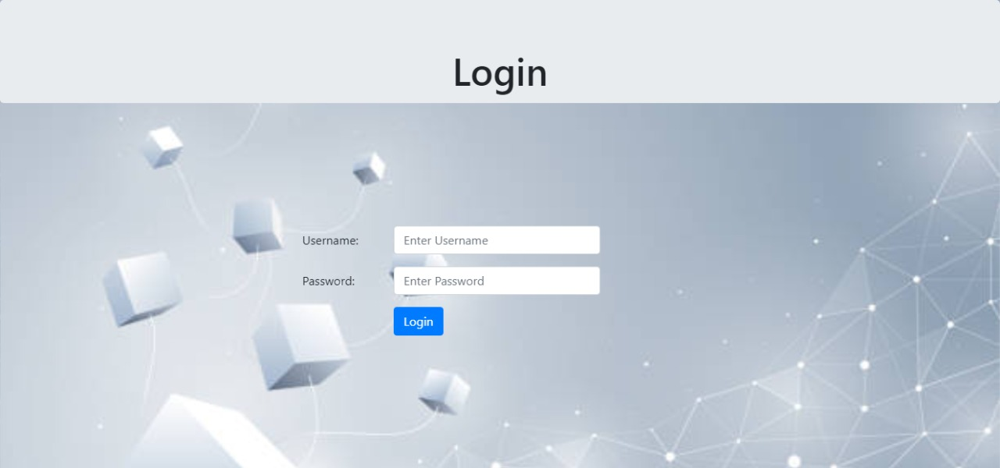
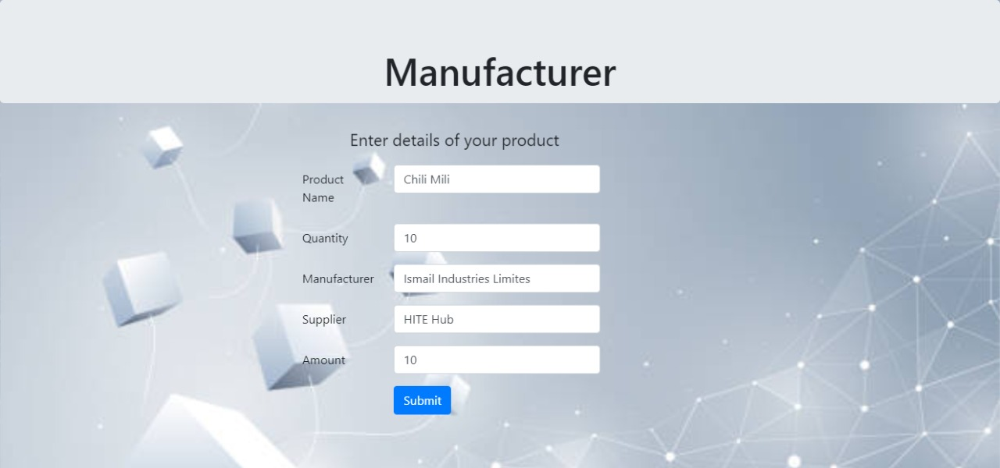
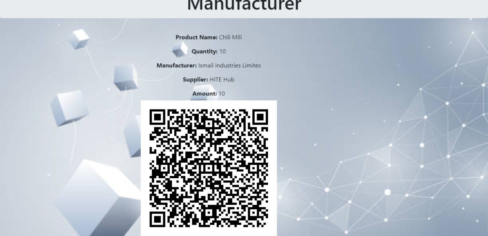
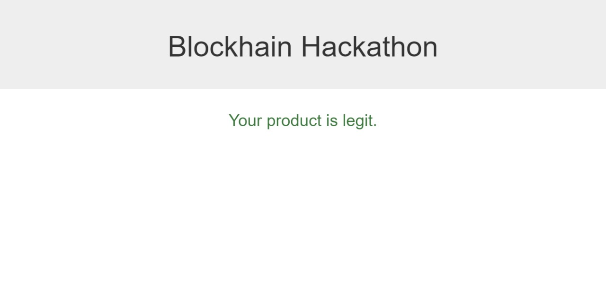
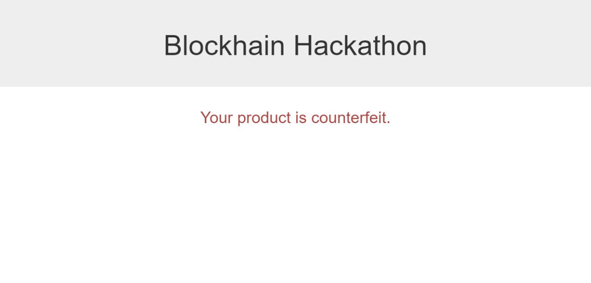

# SHARKS
Repository for Hackathon resources purpose

## Scenario
Counterfeit Checker
Counterfeit/Fake Products (Medicines/Shoes/Perfumes and etc.) are at all time high and it is becoming difficult to distinguish them from the real ones. Blockchain prevents counterfeiting by identifying provenance (i.e., proof-of-origin) of a product, because blockchain provides a secure and trusted tracking system from one end of the supply chain (the creation or mining of raw materials) all the way to other end of the supply chain (where the end user enjoys the finished product).
Build a web-app that solves this problem by leveraging blockchain features such as immutability, data-integrity, hashing, public/private keys and etc. You don't have to apply all of these features. Similarly, these aren't the only ones you can apply.

### Our Approach
We created a personal Blockchain for the solution in which a manufacturer can make its items a part of block chain and our solution  will create a unique hash and a QR code corresponding to that hash so nobody can counterfeit it. To check the authenticity of the product user can scan the QR code which will lead them to our web app and it will check the hash of the product in the blockchain if the block exsists than it is a authentic product.

 

 ## Tools Used
### FOR BLOCKCHAIN
PYTHON 
FLASK
SHA256

We basically created an API with smart contract to execute our Blockchain and authentication

### FOR BACKEND
PYHTON
DJANGO
SQLLITE
JAVASCRIPT

We basically created a BACKEND server for just login later in future we will add a Decentralized login system for this purpose

### FOR FRONTEND 
CSS 
HTML
BOOTSTRAPS

### LOGIN

### INPUT

### GENERATED QR

### LEGIT PRODUCT

### COUNTERFEIT PRODUCT

